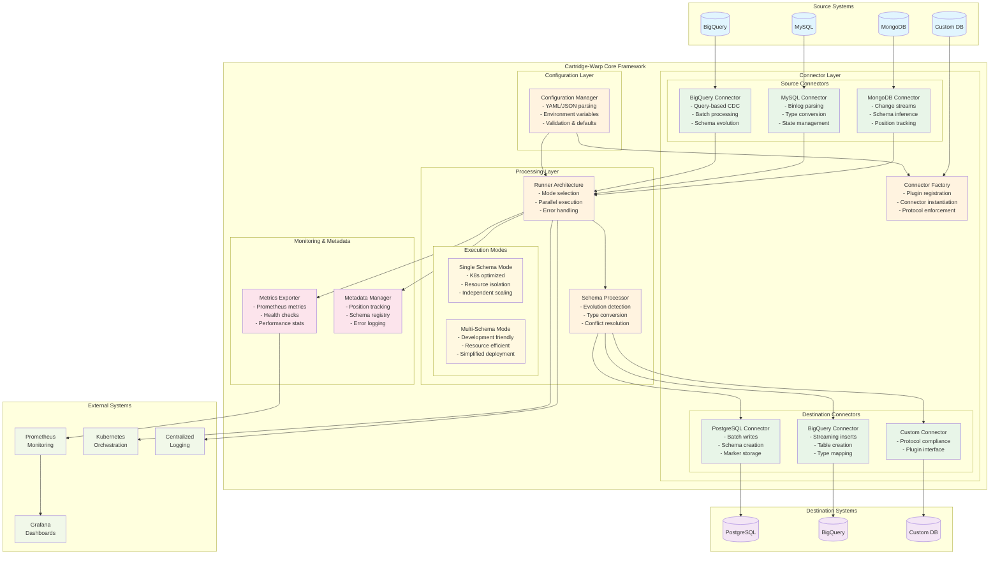

# Cartridge-Warp Architecture Diagrams

This document provides comprehensive visual diagrams explaining the cartridge-warp CDC streaming platform architecture, connection flows, and deployment patterns.

## 1. Modular Architecture Flow

The following diagram illustrates the modular design of cartridge-warp and how data flows through the system:

### Key Components Explained

#### Configuration Layer
- **Hierarchical Configuration**: Global → Schema → Table level settings
- **Environment Variable Support**: Override any configuration at runtime
- **Validation**: Pydantic-based schema validation with clear error messages

#### Connector Layer  
- **Protocol-Based Design**: Strict interface compliance ensures consistency
- **Factory Pattern**: Dynamic connector registration and instantiation
- **Pluggable Architecture**: Easy to add new database connectors

#### Processing Layer
- **Schema Evolution**: Automatic detection and handling of schema changes
- **Dual Execution Modes**: Optimized for different deployment scenarios
- **Parallel Processing**: Table-level parallelism with configurable limits

#### Monitoring & Metadata
- **Position Tracking**: Reliable CDC position management with recovery
- **Schema Registry**: Complete version history and evolution tracking
- **Comprehensive Metrics**: Performance, health, and operational insights

## 2. Data Processing Flow

```mermaid
flowchart TD
    Start([Start CDC Process]) --> InitConfig[Initialize Configuration<br/>- Load YAML/JSON config<br/>- Apply env overrides<br/>- Validate settings]
    
    InitConfig --> CreateConnectors[Create Connectors<br/>- Instantiate source connector<br/>- Instantiate destination connector<br/>- Test connections]
    
    CreateConnectors --> CheckMode{Execution Mode?}
    
    CheckMode -->|Single Schema| SingleSetup[Single Schema Setup<br/>- Target specific schema<br/>- Resource isolation<br/>- Independent scaling]
    
    CheckMode -->|Multi Schema| MultiSetup[Multi-Schema Setup<br/>- Load all schemas<br/>- Shared resources<br/>- Batch processing]
    
    SingleSetup --> InitSchema[Initialize Schema<br/>- Create destination schema<br/>- Load schema metadata<br/>- Check for evolution]
    
    MultiSetup --> InitSchemas[Initialize All Schemas<br/>- Process each schema<br/>- Parallel initialization<br/>- Error isolation]
    
    InitSchema --> ProcessTables
    InitSchemas --> ProcessTables[Process Tables<br/>- Apply table filters<br/>- Check parallelism limits<br/>- Start table processors]
    
    ProcessTables --> TableLoop{For Each Table}
    
    TableLoop --> GetMarker[Get Last Position<br/>- Query metadata store<br/>- Resume from checkpoint<br/>- Handle cold start]
    
    GetMarker --> DetectChanges[Detect Schema Changes<br/>- Compare current schema<br/>- Identify evolution<br/>- Plan conversions]
    
    DetectChanges --> SchemaEvolved{Schema<br/>Changed?}
    
    SchemaEvolved -->|Yes| ApplyEvolution[Apply Schema Evolution<br/>- Update destination schema<br/>- Log version changes<br/>- Update registry]
    
    SchemaEvolved -->|No| GetChanges[Get Data Changes<br/>- Query source connector<br/>- Apply batch size limits<br/>- Handle timeouts]
    
    ApplyEvolution --> GetChanges
    
    GetChanges --> HasChanges{Changes<br/>Available?}
    
    HasChanges -->|No| Wait[Wait Polling Interval<br/>- Configurable delay<br/>- Exponential backoff<br/>- Health checks]
    
    HasChanges -->|Yes| ProcessBatch[Process Change Batch<br/>- Transform data types<br/>- Apply business rules<br/>- Validate constraints]
    
    ProcessBatch --> WriteBatch[Write to Destination<br/>- Batch insert/update<br/>- Transaction safety<br/>- Error handling]
    
    WriteBatch --> UpdateMarker[Update Position Marker<br/>- Atomic update<br/>- Consistency check<br/>- Recovery point]
    
    UpdateMarker --> UpdateMetrics[Update Metrics<br/>- Records processed<br/>- Bytes transferred<br/>- Performance stats]
    
    UpdateMetrics --> ErrorCheck{Errors<br/>Occurred?}
    
    ErrorCheck -->|Yes| HandleError[Handle Errors<br/>- Log error details<br/>- Dead letter queue<br/>- Retry logic]
    
    ErrorCheck -->|No| ContinueCheck{Continue<br/>Processing?}
    
    HandleError --> RecoveryCheck{Recoverable<br/>Error?}
    
    RecoveryCheck -->|Yes| Wait
    RecoveryCheck -->|No| Stop([Stop Processing])
    
    ContinueCheck -->|Yes| Wait
    ContinueCheck -->|No| Cleanup[Cleanup Resources<br/>- Close connections<br/>- Flush metrics<br/>- Save state]
    
    Wait --> GetChanges
    Cleanup --> Stop
    
    %% Styling
    classDef startEnd fill:#4caf50,color:white
    classDef process fill:#2196f3,color:white
    classDef decision fill:#ff9800,color:white
    classDef error fill:#f44336,color:white
    classDef data fill:#9c27b0,color:white

    class Start,Stop startEnd
    class InitConfig,CreateConnectors,SingleSetup,MultiSetup,InitSchema,InitSchemas,ProcessTables,GetMarker,DetectChanges,ApplyEvolution,GetChanges,ProcessBatch,WriteBatch,UpdateMarker,UpdateMetrics,Wait,Cleanup,HandleError process
    class CheckMode,SchemaEvolved,HasChanges,ErrorCheck,RecoveryCheck,ContinueCheck,TableLoop decision
    class HandleError,RecoveryCheck error
    class GetChanges,ProcessBatch,WriteBatch data
```

### Processing Flow Key Features

#### Initialization Phase
- **Configuration Loading**: Multi-layered configuration with validation
- **Connection Testing**: Verify source and destination connectivity
- **Mode Selection**: Choose optimal execution strategy

#### Schema Management
- **Evolution Detection**: Automatic schema change identification
- **Version Control**: Complete schema history tracking
- **Type Conversion**: Intelligent type mapping and conversion

#### Data Processing
- **Batch Processing**: Configurable batch sizes for optimal performance
- **Position Tracking**: Reliable CDC position management
- **Error Recovery**: Comprehensive error handling with retry logic

#### Monitoring Integration
- **Real-time Metrics**: Live performance and health monitoring
- **Dead Letter Queue**: Failed record isolation and analysis
- **Audit Trail**: Complete processing history and statistics
